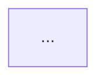

# Prompt: Architecture Map

Produce a comprehensive architecture map for the `{{PROJECT_NAME}}` codebase at `{{REPO_ROOT}}`.

## Tech stack context

- Languages and frameworks: `{{TECH_STACK}}`
- Package manager(s): `{{PACKAGE_MANAGER}}`
- Infrastructure: `{{INFRASTRUCTURE}}`

## Instructions

Traverse the repository and produce the following outputs. Where you cannot determine something with confidence, say so explicitly and rate your confidence (High / Medium / Low).

### 1. System overview (1–2 paragraphs)

Describe what this system does and who uses it. Base this on the README, entry-point files, routing configuration, and any domain model code you can find. Do not invent capabilities — only describe what the code clearly supports.

### 2. Module / service inventory

Produce a table with one row per top-level module, package, service, or bounded context:

| Name | Path | Purpose | Primary language | Entry points | External dependencies | Confidence |
|---|---|---|---|---|---|---|
| … | … | … | … | … | … | H/M/L |

### 3. Dependency graph

Produce a Mermaid diagram showing the relationships between the modules listed above. Show:
- Internal dependencies (module A imports from module B)
- External service dependencies (databases, APIs, message queues, CDNs)
- Bidirectional dependencies (flag these — they often indicate coupling problems)

### 4. Data flow summary

For the 2–3 most important user-facing operations (e.g., login, submit form, process payment), describe the data flow in numbered steps, naming the modules it passes through.

### 5. Orphaned and deprecated code

List any modules, files, or packages that appear to be:
- Unreferenced by any other code
- Explicitly deprecated (comments, naming conventions like `_old`, `_deprecated`)
- Disabled via feature flags that have been off for more than one release

### 6. Open questions for incumbent review

List the specific things you were unable to determine confidently. Each item should be a question the incumbent team can answer quickly.

---

## Output format

Markdown. Save to `baseline/01-architecture-map.md`. Every section heading must be present even if empty (mark empty sections "Not determined — see open questions").

## Quality reminder

This is a **draft for senior-engineer review**. Do not assert things you cannot verify from the code. Confidence ratings are mandatory.
